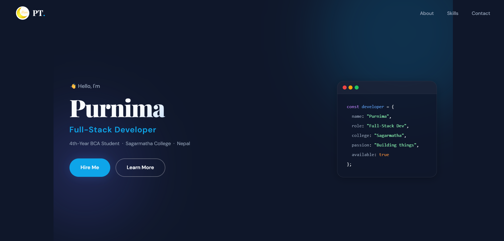
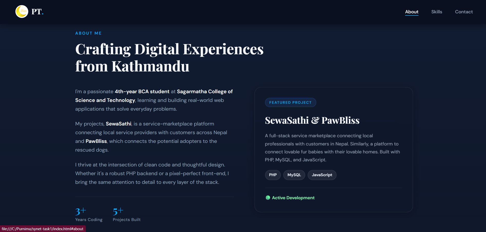
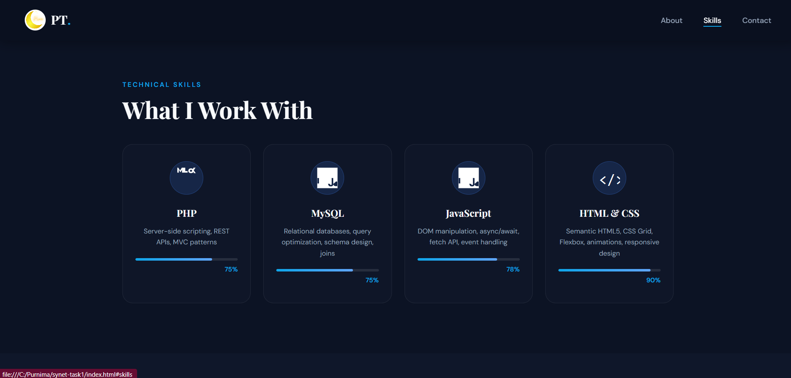
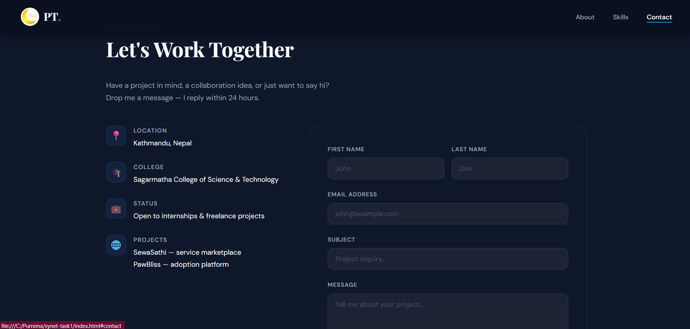
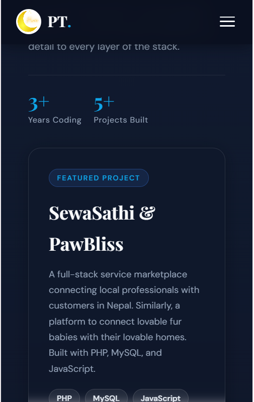

# My Portfolio Website — Synet Task 1

**Name:** Purnima  
**College:** Sagarmatha College of Science and Technology  
**Program:** BCA — 4th Year  
**Task:** Basic Level · Task 1 · Personal Portfolio Website  
**Repo:** [synet-task1-portfolio-purnima](https://github.com/purnimm45/synet-task1-portfolio-purnima)

---

## What Is This?

This is my personal portfolio website I made for Synet Task 1. The idea was simple — I wanted one place where someone could look me up and understand who I am, what skills I have, and what projects I've actually built. Instead of just listing things on a piece of paper, I built a whole website for it.

I did the entire thing with plain HTML, CSS, and JavaScript. No React, no Tailwind, no frameworks. I made that choice on purpose because I wanted to actually understand what I was writing, not just copy-paste component names I don't fully get yet.

---

## Video Walkthrough

🎥 **https://youtu.be/37c3Hs2kVqQ**

*(~3 minute screen recording showing the full site, responsiveness on mobile, and all sections)*

---

## Screenshots

### 1. Hero / Landing Section


### 2. About Me Section


### 3. Skills Section


### 4. Contact Section


### 5. Mobile View (Responsive)


> 📁 All screenshots are inside the `/screenshots` folder in this repo.

---

## Features

- Fully responsive — desktop, tablet, and mobile
- Sticky navbar that gets a blurred dark background when you scroll down
- Mobile hamburger menu with a slide-in drawer
- Smooth fade-in animations as you scroll (using IntersectionObserver)
- Animated skill progress bars
- Code card in the hero section showing my info as a JS object — thought it was a fun touch
- My own custom logo (pt.png) in the navbar
- Contact form with a success toast message on submit

---

## My Projects (Featured on the Site)

**SewaSathi** — A service marketplace for Nepal. People can find and book local professionals like plumbers, electricians, tutors etc. The idea came from how frustrating it is to find reliable help in Kathmandu. Backend is PHP + MySQL, frontend is HTML/CSS/JS.

**PawBliss** — A dog adoption platform connecting rescued dogs with people who want to adopt. I care about animals and wanted to build something that actually matters. Same stack — PHP, MySQL, JavaScript.

---

## Tech Stack

| What | Why |
|------|-----|
| HTML5 | Structure and semantic markup |
| CSS3 | All styling — Flexbox, Grid, custom properties, animations |
| Vanilla JavaScript | Scroll effects, hamburger menu, form toast |
| Google Fonts | Playfair Display (headings) + DM Sans (body) |

---

## File Structure

```
synet-task1-portfolio-purnima/
├── index.html
├── style.css
├── pt.png                  ← my logo
├── README.md
├── report.md
└── screenshots/
    ├── 01-hero.png
    ├── 02-about.png
    ├── 03-skills.png
    ├── 04-contact.png
    └── 05-mobile.png
```

---

## How to Run

1. Clone the repo:
```
git clone https://github.com/purnimm45/synet-task1-portfolio-purnima.git
```
2. Open the folder and just double-click `index.html`

That's it. No installs, no terminal commands, nothing. Opens straight in the browser.

---

## Honest Struggles

- Getting the hero section to stack properly on mobile took me longer than I expected. The two-column flex layout kept breaking on small screens and I had to tweak paddings and directions quite a bit.
- The IntersectionObserver for the scroll animations — I'd seen it in tutorials but doing it myself was different. Figuring out the threshold value and why some cards weren't animating took time.
- The hamburger-to-X animation using `nth-child` transforms felt confusing at first.

---

## What I'd Add Next

- Actually connect the contact form to send real emails
- A full projects section with more of my work
- Maybe a light mode toggle
- Smoother mobile experience overall

---

## Commits

The repo has commits showing the actual build process step by step — from initial structure all the way to final styles and README update.

---

*Purnima · BCA 4th Year · Sagarmatha College · 2026*  
*Built with HTML, CSS, JS — and a lot of late nights*
